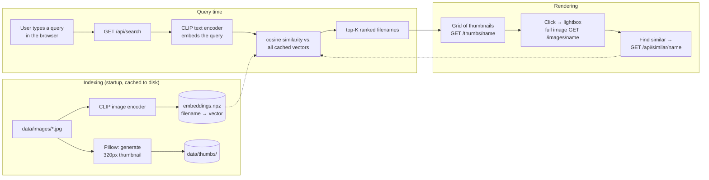

# Image Semantic Search

Type a natural-language description and get back the most relevant images from a folder — no tags, no manual labeling. Built as a single small Python service (FastAPI) with a plain HTML/CSS/JS frontend, backed by [CLIP](https://openai.com/research/clip) for the actual "understanding."

## What it does

- **Semantic search** — type e.g. *"mountains at sunset"* or *"food on a table"* and get images ranked by meaning, not keywords.
- **Find similar** — click any result to open it full-size, then hit **Find similar** to search by that image instead of text (image → image).
- **Filename search** — a literal substring fallback, toggled next to the search box, for when you want an exact match instead of a vibe.
- A responsive, dark-themed gallery UI with lazy-loaded thumbnails and a lightbox viewer.

## How it works



CLIP maps both images and text into the *same* vector space, so "a photo of a dog" and an actual photo of a dog end up near each other. That's the whole trick: embed every image once, embed the query text on each search, and rank by cosine similarity.

## Project layout

```
app/
  main.py       FastAPI app: routes + static file mounts
  indexer.py    builds/loads the CLIP embedding + thumbnail cache
  search.py     semantic / image-similarity / filename ranking
scripts/
  fetch_sample_images.py   downloads the demo image set
static/
  index.html, style.css, app.js   the frontend (no build step)
data/
  images/       source images (committed — the demo set)
  thumbs/       generated thumbnails (gitignored, rebuilt on first run)
  embeddings.npz generated vector cache (gitignored, rebuilt on first run)
```

## Usage

```bash
python3 -m venv .venv
source .venv/bin/activate
pip install -r requirements.txt

# only needed if data/images/ is empty — the demo set is already committed
python scripts/fetch_sample_images.py

uvicorn app.main:app --reload
```

Open **http://localhost:8000**. First launch downloads the CLIP model weights (~600MB, one-time, cached by Hugging Face under `~/.cache`) and embeds the images — a few seconds to ~1 minute depending on connection/CPU. Every run after that loads the cache instantly, since embeddings are keyed by filename and only new/unseen images get (re-)embedded.

To search your own folder instead of the sample set: drop images into `data/images/`, delete `data/embeddings.npz` (or just leave it — new files are picked up automatically, existing ones are skipped), and restart the server.

## Search methods

| Method | Endpoint | How it ranks |
|---|---|---|
| Semantic (text → image) | `GET /api/search?q=...&method=semantic` | cosine similarity between CLIP text embedding of the query and cached CLIP image embeddings |
| Find similar (image → image) | `GET /api/similar/{filename}` | cosine similarity using an existing image's cached embedding as the query vector |
| Filename | `GET /api/search?q=...&method=filename` | plain substring match on filename |

All three share the same in-memory index built once at startup (`app/indexer.py`), so adding a new search method is just a new ranking function in `app/search.py`.

## FAQ / design decisions

**How is image serving kept low-latency and cheap?**
The gallery only ever loads small pre-generated thumbnails (`/thumbs/...`, ~320px, lazy-loaded with `loading="lazy"`); full-resolution originals are only fetched when a user opens the lightbox. Both are served as plain static files via FastAPI's `StaticFiles` (no per-request computation, no template rendering) — cheap to serve and fast to respond. In a real deployment, this same shape (small derivative for listing, original on demand) would map directly onto object storage (S3/GCS) behind a CDN.

**Why brute-force cosine similarity instead of a vector database?**
The demo corpus is tens of images, so a `numpy` dot product over all vectors is sub-millisecond and far simpler than standing up FAISS or a hosted vector DB. This is the one piece explicitly designed to be swapped out: past roughly 10k–100k images, replace `app/search.py`'s `_rank()` with an ANN index (FAISS/HNSW) or a managed vector store (pgvector, Pinecone, etc.) — the rest of the app (indexing, API shape, frontend) doesn't need to change.

**Why a local CLIP model instead of an API (e.g. OpenAI embeddings)?**
No per-search cost, no network round-trip beyond localhost, no API key — directly serving the "low latency and cheap" requirement. The tradeoff is a one-time ~600MB model download and using CPU inference (fine at this scale; would move to GPU/batched inference for large catalogs or heavy write traffic).

**What happens when images are added or removed?**
Indexing is incremental: on startup, `indexer.py` diffs the files in `data/images/` against what's already in `embeddings.npz` and only embeds files it hasn't seen before. Removed files simply won't appear in the next rebuilt cache. There's no file-watcher — the check runs on process startup, matching the scope of this challenge.

**What are the limitations?**
CLIP is a general-purpose zero-shot model: it's good at scene/object/style-level semantics but weaker at counting, fine spatial relationships, or reading text embedded in images. It's also English-centric. This app has no auth, no multi-user isolation, and no persistence beyond the local filesystem — all reasonable to add if this moved beyond a local demo.

**How would you productionize this?**
Move originals + thumbnails to object storage behind a CDN; generate thumbnails in a background job on upload rather than synchronously; swap brute-force search for an ANN/vector-DB index; move indexing off the request path entirely (a queue + worker); add auth and per-user/tenant image scoping; add basic observability (search latency, cache hit rate).

## Video demo checklist

1. Load the page — show the full gallery of thumbnails.
2. Type a natural-language query (e.g. *"a dog running"*, *"mountains at sunset"*) — show ranked results updating live.
3. Click a result to open the lightbox with the full-resolution image.
4. Click **Find similar** — show the image-to-image results.
5. Toggle to **Filename** search and show the literal-match fallback.
